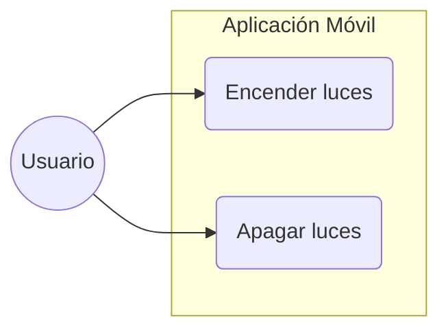
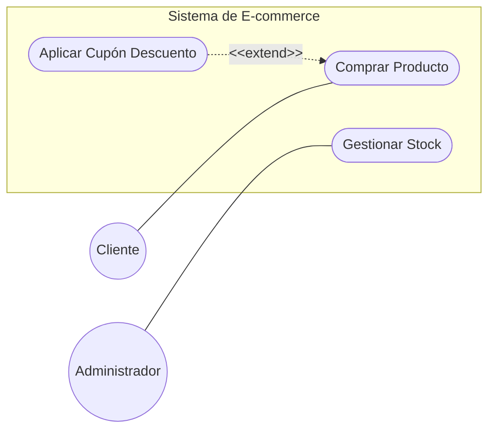

# Actividades-Casos-De-Uso

Diagramas de Casos De Uso en Mermaid

Ejercicio 1.


 
 Ejercicio 2.


Ejercicio 3.

```mermaid

     graph LR
    %% Actores
    Espectador((Espectador))
    Editor((Editor de Contenido))
    Pasarela[Pasarela de Pagos]

    subgraph Sistema_Streaming [Plataforma de Streaming]
        UC1(Reproducir Película)
        UC2(Subir Nuevo Video)
        UC3(Renovar Suscripción)
        UC4(Validar Suscripción)
        UC5(Activar Subtítulos)

        %% Relaciones internas (UML)
        UC1 -.->|include| UC4
        UC5 -.->|extend| UC1
    end

    %% Interacciones de los Actores
    Espectador --- UC1
    Espectador --- UC3
    Editor --- UC2
    UC3 --- Pasarela

  ```
    
